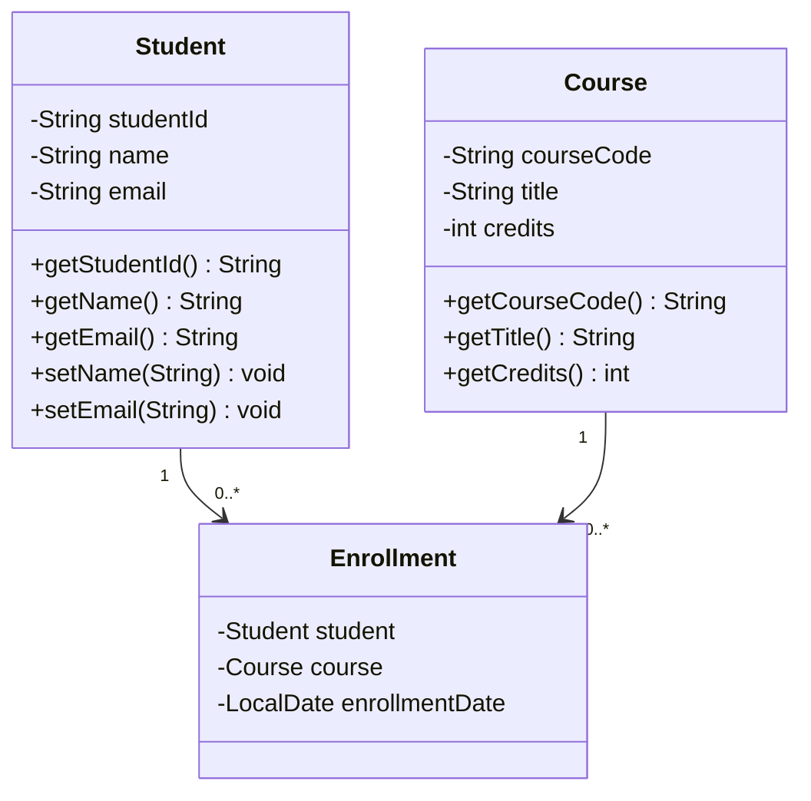

```mermaid
classDiagram
    class Student {
        -String studentId
        -String name
        -String email
        +getStudentId() String
        +getName() String
        +getEmail() String
        +setName(String) void
        +setEmail(String) void
    }
    class Course {
        -String courseCode
        -String title
        -int credits
        +getCourseCode() String
        +getTitle() String
        +getCredits() int
    }
    class Enrollment {
        -Student student
        -Course course
        -LocalDate enrollmentDate
    }
    Student "1" --> "0..*" Enrollment
    Course "1" --> "0..*" Enrollment
```
